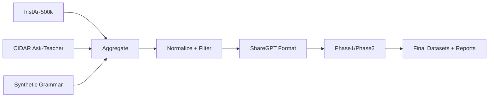

# Madinah Data Curation

End-to-end data preparation pipeline for MadinahQA-focused Arabic fine-tuning.
This folder contains scripts to aggregate core datasets, generate targeted
grammar MCQs, normalize and format data, and build a two-phase curriculum.

Detailed rationale: see `DETAILS.md`.
Direct python usage: see `COMMANDS.md`.
Single-run script: `python3 madinah_data_curation/run_all.py`.

## Pipeline at a glance



## Steps (what + why)

1) **Aggregate core datasets** (`00_fetch_datasets.py`)
   - What: Stream InstAr-500k and CIDAR into JSONL.
   - Why: InstAr provides broad Arabic comprehension; CIDAR provides dense grammar.

2) **Generate synthetic grammar** (`01_generate_synthetic_grammar.py`)
   - What: Produce MCQ + short dialogues from a curriculum prompt.
   - Why: Boost grammar volume to match MadinahQA’s syntax focus.

3) **Normalize + language filter** (`02_normalize_filter.py`)
   - What: Unicode cleanup, remove noise, keep MSA via ratio/fastText.
   - Why: Reduce cross-language interference and formatting drift.

4) **ShareGPT formatting** (`03_format_sharegpt.py`)
   - What: Convert to `messages` with a strict Arabic system prompt.
   - Why: Standard fine-tuning format and consistent answer style.

5) **Curriculum build** (`07_build_curriculum.py`)
   - What: Split into Phase 1 (InstAr) and Phase 2 (grammar-heavy).
   - Why: Broad adaptation first, then grammar injection with LR decay.

6) **Diagnostics + audit** (`08_profile_report.py`, `09_sample_audit.py`)
   - What: Compute language/MCQ stats and sample slices for review.
   - Why: Validate that data quality matches MadinahQA requirements.

## Folder layout

- `raw/` - downloaded and generated raw datasets
- `intermediate/` - normalized and formatted datasets
- `final/` - curriculum outputs
- `reports/` - profile and audit reports
- `prompts/` - synthetic generation prompt templates

## Dependencies

- Python 3.10+
- `datasets` (Hugging Face)
- `pyyaml`
- `openai` (for OpenAI-compatible API calls)
- `fasttext` + lid.176.ftz (for language filtering, optional)

Install only what you need for the steps you plan to run.

## Quick start

1) Fetch core datasets (HF)
```
python madinah_data_curation/00_fetch_datasets.py
```

2) Generate synthetic grammar data (OpenAI-compatible API)
```
python madinah_data_curation/01_generate_synthetic_grammar.py \
  --api-base https://api.example.com/v1 \
  --api-key sk-... \
  --model your-model \
  --max-examples 2000
```

3) Normalize + language filter
```
python madinah_data_curation/02_normalize_filter.py
```

4) Format to ShareGPT
```
python madinah_data_curation/03_format_sharegpt.py
```

5) Build curriculum
```
python madinah_data_curation/07_build_curriculum.py
```

6) Diagnostics + samples
```
python madinah_data_curation/08_profile_report.py
python madinah_data_curation/09_sample_audit.py
```

## Outputs

- `final/phase1.jsonl` - broad comprehension phase
- `final/phase2.jsonl` - grammar-focused phase
- `final/curriculum.yaml` - suggested phase weights/order

## Notes

- Scripts are designed to stream JSONL files to handle large corpora.
